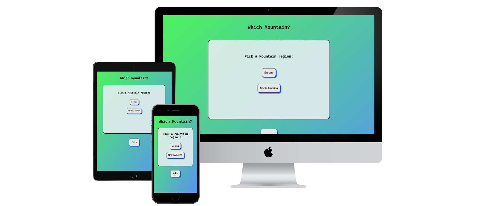

# Project-2
Project 2 Javescript
# ux 
# table of contents

# Higher or Lower Mountains
## A online game about the heights of mountains
### Portfolio Project 2 - Luke Courtney
------------------
> Higher or Lower Mountains is a online JavaScript game where you pick the heights of mountain ranges.

> This website is showcasing JavaScript, HTML and CSS for Project Portfolio 2 that can be accesed though this [Link]()

## [Live Site]()
--------------------------------

## [Respository]()
----------------------------------

---------------------------------

## Table of contents

1. [ UX ](#ux)
2. [ Features ](#features)
3. [ Features left to Implement ](#left)
4. [ Technology used ](#tech)
5. [ Testing ](#testing)
6. [ Bugs ](#bugs)
7. [ Deployment ](#deployment)
8. [ Credits ](#credits)
9. [ Acknowledgements ](#acknowledgements)

## UX

# UX design

# Features
> The following is a summery of the features already in place.

# Features left to Implement
>  These are features that I would have liked to implement for the site if I had more available time and more knowledge on the subject.

# Future Features
>
>

# Technologies Used

### Html
>Used to structure my webpages.

### CSS
>Used to provide style, layout and responsiveness to my website.

### Font Awesome
>Used for all the social media icons.

### Google Fonts
>Used for all the fonts on my website.

### Canva
>Used to design The Forty Foot logo used in Header.

# Testing
>Testing on this project was mainly done by myself and a few friends to determine site usablity, reponsiveness and ensure its intuitive to a new user.

### Testing Phase

**Testing for links**

| Test              | Outcome |
|-------------------|---------------|
|All links on Navigation lead to their correct pages| Pass  |
|Footer social links all lead to their respective social media sites |Pass|
|Content reformats on smaller screens|pass|
|All images load on pages|pass|

**Testing for reponsiveness**
| Test              | Outcome |
|-------------------|---------------|
|Home page, about, portfolio, contact us displays correctly on screens larger than 950px|Pass |
|Home page, about, portfolio, contact us displays correctly on screens smaller than 950px|Pass |

## Google Lighhouse Testing
