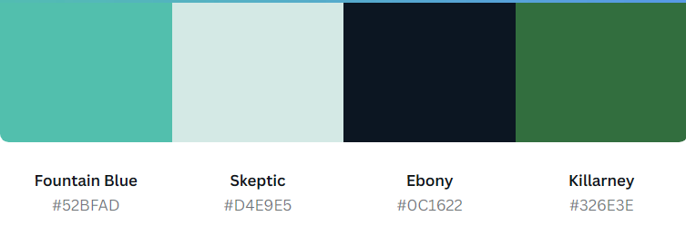

# Which Mountain?

## [Live Site](https://lukecdev.github.io/Which-Mountain/)

## [Respository](https://github.com/lukecdev/Which-Mountain)
----------------------------------
 

## Introduction 
> Which Mountain? is a online JavaScript quiz to showcase JavaScript, HTML and CSS to create a interactive for front-end site, that responds to users actions.

## Table of contents

1. [ UX ](#ux)
2. [ Features ](#features)
3. [ Features left to Implement ](#left)
4. [ Technology used ](#tech)
5. [ Testing ](#testing)
6. [ Bugs ](#bugs)
7. [ Deployment ](#deployment)
8. [ Credits ](#credits)
9. [ Acknowledgements ](#acknowledgements)

## UX

## Colour Design

# Features
> The following is a summery of the features already in place.

# Features left to Implement
>  These are features that I would have liked to implement for the site if I had more available time and more knowledge on the subject.

# Future Features
>
>

# Technologies Used

### Html
>Used to structure my webpages.

### CSS
>Used to provide style, layout and responsiveness to my website.

### Google Fonts
>Used for all the fonts on my website.

### Git
>For version control, commiting code and pushing changed code to Github.

### Github
>For storing the repository, files and images that are pushed from VScode.

### 

# Testing
>Testing on this project was mainly done by myself and a few friends to determine site usablity, reponsiveness and ensure its intuitive to a new user.

### Testing Phase

**Testing for links**

| Test              | Outcome |
|-------------------|---------------|
|All links on Navigation lead to their correct pages| Pass  |
|Footer social links all lead to their respective social media sites |Pass|
|Content reformats on smaller screens|pass|
|All images load on pages|pass|

**Testing for reponsiveness**
| Test              | Outcome |
|-------------------|---------------|
|Home page, about, portfolio, contact us displays correctly on screens larger than 950px|Pass |
|Home page, about, portfolio, contact us displays correctly on screens smaller than 950px|Pass |

## Google Lighhouse Testing

# Deployment

> To deploy the project I followed these steps starting from the main project repository [here](https://github.com/lukecdev/Which-Mountain).
 1. Clicked on `Settings` on the navigation menu in the repository
 2. I then selected the `Pages` menu on the side bar.
 3. In the first dropdown menu labeled `Source` I selected the branch of the name `main` from the dropdown.
 4. In the next dropdown labeled `/root` I left as the default option.
 5. Selected Save
 
> I then received a notification from GitHub that my project is being deployed and after about 1 minute & a couple of refreshes of the page it was ready and live.

# Credits

## Resources

### W3 schools
> Used for general lookup for HTML and CSS synthax queries.

### Pinclipart.com
>Used to get a png logo image.

### Stack Overflow
> Used to query issues relating to CSS issues I had experienced.

### Code Institute
> Project created in line with course content and within project 1 scope.

## Content
Text content on all pages was copied and/or amended from the following sites:

## Acknowledgements

A huge thanks to [Chris Quinn](https://github.com/10xOXR) for his help, suggestions and patiece while I put together this project. 