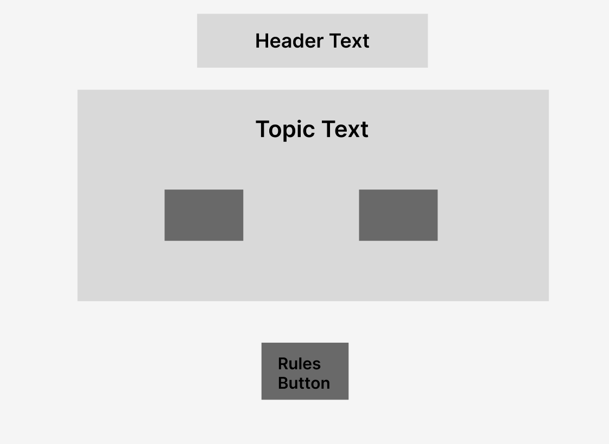
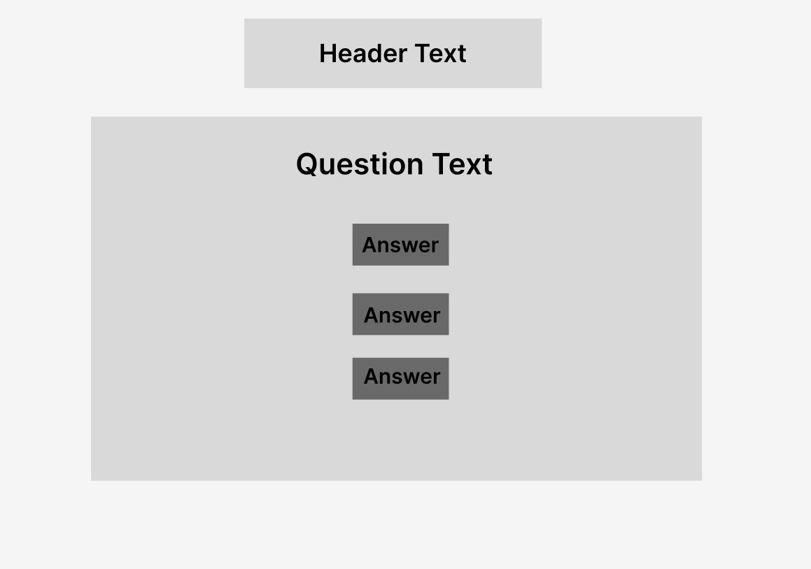
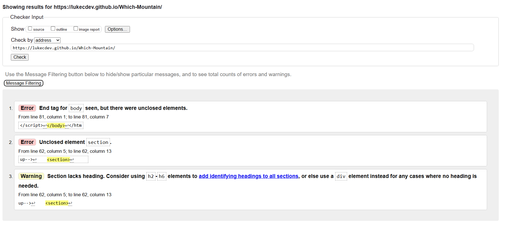
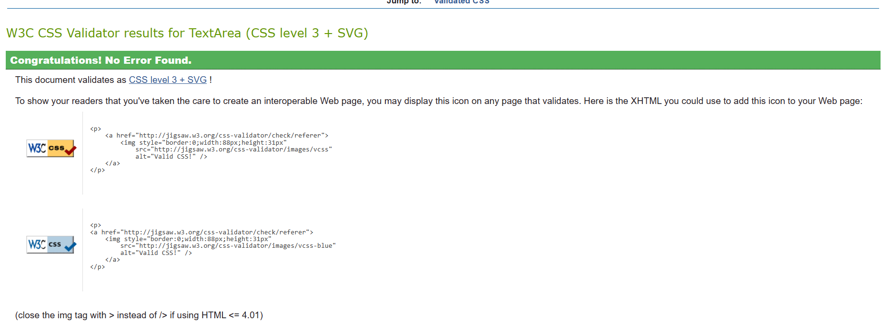

# Which Mountain?

### [Live Site](https://lukecdev.github.io/Which-Mountain/)

### [Respository](https://github.com/lukecdev/Which-Mountain)
----------------------------------
 

## Introduction 
> Which Mountain? is a online JavaScript quiz to showcase JavaScript, HTML and CSS to create a interactive for front-end site, that responds to users actions.

## Table of contents

1. [ User Experience ](#UserExperience)
2. [ Features ](#features)
3. [ Features left to Implement ](#left)
4. [ Technology used ](#tech)
5. [ Testing ](#testing)
6. [ Bugs ](#bugs)
7. [ Deployment ](#deployment)
8. [ Credits ](#credits)
9. [ Acknowledgements ](#acknowledgements)

## User Experience (UX)

The quiz was designed to be simple with intuitive functionality in mind. For all the features to be self-explanetory and to progress though the quiz quickly.

### Wireframes

The Wireframes where designed on Figma.

- Start Section

- Question Section

- ### User Stories 

    1. As a user, I want to test my knowledge on mountains.
    2. As a user, I want to be able to easily navigate through the site.
    3. As a user, i want to choose a topic to get questioned on.
    4. As a user, I want to choose from a range of answers.
    5. As a user, I want to see how many are correct and incorrect as I progress.

### Colour Design

    - black was used for the text
    - background color: Gradient from rgba(76, 243, 95, 1), rgba(89, 143, 246, 1)
    - button shadow: #0043DE
    - balck was used for quiz and start area border

## Features
The site contains all necessary features of a simple, functioning quiz.

### Existing Features

- **Heading**
    - Displays the name of the quiz.
    - Located ath the top of the site.

    

- **Start Section**
    - Displays the topics for the user to choose.
    - When one of the topic buttons in pressed, it displays the desired questions.

         

- **Game Rules**
    - Located at the bottom of the page.
    - The rules section is displayed and hidden when Rules button is pressed.
    - When the rules button is pressed, the start section is hidden and then shows after the rules section is closed.
    - When the rules section is displayed, the rules button inner text is changed to "Home" to show the user where to click next. 

     

- **Quiz Area**
    - Shows the displayed question.
    - Shows the answer buttons.

    

- **Score Counter**
    - Allows users to see their correct and incorrect score as they progress.

    

- **Final Score**
    - Fianl section that is displayed after the final answer is selected.
    - Displays the users final score from the correct answers.
    - Has a return to the start button.

        

## Features left to Implement
These are features that I would have liked to implement for the site if I had more available time and more knowledge on the subject.
    - High score tracker, to add a highscores modal for each seperate game. To be able to input username to push to a leaderboard.
    - Countdown Clock, a timer that counts down when a question is presented to the user to display how long the user has left to answer the question. 

# Technologies Used

- [HTML5](https://en.wikipedia.org/wiki/HTML) for markup
- [CSS3](https://en.wikipedia.org/wiki/CSS) for the stylesheet 
- [Github]( https://github.com/) for file management & version control 
- [Codeanywhere](https://codeanywhere.com/) for code editing and pushing commits

# Testing
- The W3C Markup Validator, W3C CSS Validator Services and jshint.com were used to validate every page of the project to ensure there were no syntax errors in the project.

## Testing Phase

### Validator Testing

- HTML ([W3C validator](https://validator.w3.org/))

    
    - Error found at closing end tag on line 81. Detects unclosed elements at this line.
    - Error found on line 62 unclosed element at section.
    - Warning to add more headings to line 62 section. 

- CSS [Jigsaw](https://jigsaw.w3.org/css-validator/)

     

     No errors found.

- JavaScript [JSHint](https://jshint.com/)
    
    - No significant issues.

**Manual Testing**

| Test              | Outcome |
|-------------------|---------------|
|When a topic button is pressed the relevent questions appear| Pass  |
|When the rules button is clicked it deplays the rules| Pass  |
|When a answer is selected it moves to the next question| Pass |
|When a answer is selected the score counter increases| Pass  |
|Content reformats on smaller screens| Pass |
|When the final answer is selcted the final score appears| Pass |
|The final score is displayed with the correct score| Pass  |

**Browser Testing**

Browser Tested | Working Status
---------------|---------------
Chrome | Works as expected
Firefox | Works as expected
Microsoft Edge | Works as expected

**Device Testing**

Device Tested | Working Status
--------------|---------------
lenevo Yoga Slim | Works as expected
OnePlus Nord 2T | Works as expected

### Google Lighhouse Testing

The site was testing using Lighthouse

# Bugs
    - When the rules section displays the user can return to the home section with the rules section not hidden. This is a link issue.

# Deployment

- The project was deployed to Github pages using the following steps:
1. Log into Github and located the [Github repository](https://github.com/lukecdev/Which-Mountain).
2. Click on the settings icon at the top of the repository.
3. Scroll down until you come to the Github pages section
    - On this part it says it now has it's own dedicated tab and to click check it out click this.
4. Where it says **source** select **main**, next to this should say root.
5. Click save, then refresh the page.

## Forking the repository
1. Log into the Github repository.
2. Underneath your avatar is a button labelled **Fork**, click this.
3. You should have your own copy now.

## Cloning the repository
1. Log into Github and locate the repository.
2. Under the repository name click the button labelled **code**.
3. You will see an option to clone or download.
4. Copy the url for cloning by clicking the clipboard icon.
5. Launch Codeanywhere or your own choice of directory.
6. Change the current working directory to the location you want the cloned directory to be.
7. Type git clone and paste the Url from step 4. 
8. Press enter to create the cloned directory.

# Credits

## Resources

- [Code Institute](https://codeinstitute.net/) Course material & the Slack community 
- [W3Schools]( https://www.w3schools.com/) as reference material
- [Am I Responsive](http://ami.responsivedesign.is/) – generate an image of the site on different sized screens
- [W3C Markup](https://validator.w3.org/) Validate HTML code
- [W3C CSS](https://jigsaw.w3.org/css-validator/) CSS Validation 
- [JSHint](https://jshint.com/) Javascript Validation

## Content
Text content on all pages was copied and/or amended from the following sites:
    - [Europe Mountains](https://www.muchbetteradventures.com/magazine/the-10-highest-mountains-in-europe/) Site used to get information for europe questions.
    - [Europe Wiki](https://en.wikipedia.org/wiki/List_of_highest_points_of_European_countries) Wiki used to get information for europe questions.
    - [North America](https://www.geographyrealm.com/the-highest-11-mountains-in-the-united-states/) Website used to get information for North America questions.

## Acknowledgements

A huge thanks to [Chris Quinn](https://github.com/10xOXR) for his help, suggestions and patiece while I put together this project. 